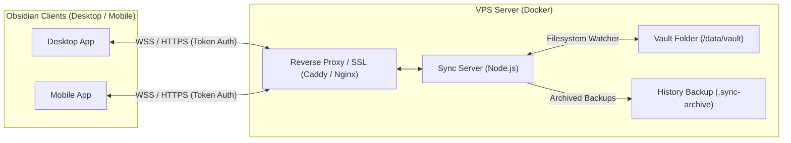

# VPS Live Vault Sync for Obsidian

> **Personal Project / AI-Coded Notice**  
> This project was developed with AI assistance for my own personal note-taking workflow. I am sharing it publicly as open source in case anyone else is looking for a similar self-hosted sync setup between their devices and a VPS.

> **Security Disclaimer**  
> This project is provided as-is, for self-hosting. Authentication relies on a shared secret token over WebSockets. Always put the server behind a secure reverse proxy with TLS/HTTPS (such as Caddy, Nginx, or Cloudflare Tunnels), use a strong token, and make regular backups of your vault. Use at your own risk.

---

## What It Does

This tool keeps your **Obsidian** vault synchronized between your devices (Desktop, iOS, Android) and a directory on your self-hosted **VPS server**.

- **Normal Files on VPS**: Your notes and attachments live as regular files on your server disk. You can view or edit them directly with vim, SSH, or scripts.
- **Real-Time Sync**: Changes sync over WebSockets when devices are connected.
- **Live UI Updates**: Changes to themes, Minimal color schemes, and folder icons update on screen without needing to restart Obsidian.
- **Config & Plugin Sync**: Syncs your `.obsidian/` folder (plugins, themes, snippets) if enabled.
- **Line Merging**: Markdown notes merge non-conflicting lines automatically. If two devices edit the same line at once, a conflict file is saved so nothing gets overwritten.
- **Trash & History**: Overwritten or deleted notes are backed up into a `.sync-archive/` folder on your VPS.
- **Offline Support**: Edits made while offline are saved locally and synced once you reconnect.

---

## Architecture



---

## Server Setup (VPS)

### Option 1: Docker Compose with Automatic HTTPS (Caddy)

1. Clone this repository on your VPS:
   ```bash
   git clone https://github.com/lmLumos/vps-vault-sync.git
   cd vps-vault-sync/docker
   ```

2. Edit `docker-compose.caddy.yml`:
   ```yaml
   services:
     sync-server:
       environment:
         - SYNC_TOKEN=choose-a-strong-secret-token
       volumes:
         # Path to your vault folder on your VPS:
         - /home/ubuntu/my-vault:/data/vault

     caddy:
       environment:
         - DOMAIN=sync.yourdomain.com
         - EMAIL=youremail@example.com
   ```

3. Start the container:
   ```bash
   docker compose -f docker-compose.caddy.yml up -d
   ```

---

### Option 2: Standard Docker Compose (Existing Nginx / Reverse Proxy)

If you already have Nginx, Traefik, or a Cloudflare Tunnel:

```yaml
version: '3.8'
services:
  sync-server:
    build:
      context: ..
      dockerfile: packages/server/Dockerfile
    container_name: vps-vault-sync
    restart: unless-stopped
    ports:
      - "3000:3000"
    environment:
      - SYNC_TOKEN=choose-a-strong-secret-token
      - VAULT_PATH=/data/vault
      - ARCHIVE_RETENTION_DAYS=30
    volumes:
      - /path/to/your/vault:/data/vault
```

Run:
```bash
docker compose up -d
```

---

## Plugin Installation

### Method 1: Using BRAT (Recommended for Mobile & Desktop)

1. In Obsidian, install the community plugin **BRAT** (`Obsidian42 - BRAT`).
2. Go to **Settings > Community plugins > BRAT**.
3. Under **Plugins list**, click **Add Beta plugin**.
4. Enter the repository URL:
   ```text
   lmLumos/vps-vault-sync
   ```
5. Click **Add Plugin**, then enable **VPS Live Vault Sync** in your Community plugins list.

---

### Method 2: Manual Installation

1. Download `main.js`, `manifest.json`, and `styles.css` from the GitHub Releases page.
2. Put them in your vault folder under:
   `<YourVault>/.obsidian/plugins/vps-vault-sync/`
3. In Obsidian, go to **Settings > Community plugins**, click **Reload plugins**, and enable **VPS Live Vault Sync**.

---

## Plugin Settings

In Obsidian, go to **Settings > VPS Live Vault Sync**:

- **Server URL**: `wss://sync.yourdomain.com` (or `ws://YOUR_SERVER_IP:3000`)
- **Secret API Token**: The `SYNC_TOKEN` you set on your server.
- **Device Name**: A name for your device (e.g. *Laptop*, *Phone*).
- Click **Test Connection** to check if it connects.
- Click **Sync Now** to do an initial sync.

---

## Environment Variables (Server)

| Variable | Default | Description |
| :--- | :--- | :--- |
| `SYNC_TOKEN` | *Required* | Secret token for authentication |
| `VAULT_PATH` | `/data/vault` | Path where files are stored inside the container |
| `PORT` | `3000` | Port the server listens on |
| `HOST` | `0.0.0.0` | Bind address |
| `ARCHIVE_RETENTION_DAYS` | `30` | Days to keep backups of edited/deleted notes |
| `MAX_FILE_SIZE_MB` | `100` | Max file upload size in MB |
| `DEBOUNCE_MS` | `400` | Debounce time before syncing disk changes |
| `SYNC_OBSIDIAN_CONFIG` | `true` | Sync `.obsidian` plugins, themes, and settings |
| `SYNC_WORKSPACE` | `false` | Sync `workspace.json` layout file |

---

## Excluding Files (`.syncignore`)

You can create a `.syncignore` file in the root of your vault to ignore files or folders:

```gitignore
# Exclude private notes
Private/**

# Exclude temporary files
node_modules/
*.log
```

---

## Building from Source

This is a TypeScript monorepo using npm workspaces:

```bash
# 1. Install dependencies
npm install

# 2. Build packages
npm run build

# 3. Run tests
npm test
```

---

## License

MIT License. Feel free to use, modify, or fork.