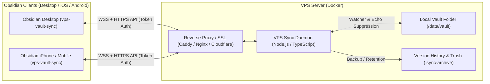

# ⚡ VPS Live Vault Sync for Obsidian

A high-performance, real-time, bi-directional synchronization system between **Obsidian** (Desktop, iOS & Android) and a self-hosted **VPS server**.

Your notes, attachments, plugins, themes, and configuration files live on your VPS as a **normal, human-readable directory**. Edit files on your VPS with vim, VS Code Remote, or automated scripts, and watch them update live in Obsidian across all your devices with sub-second latency.

---

## ✨ Key Features

- **⚡ Real-Time Bidirectional Sync**: Instant live syncing over WebSockets with automatic reconnection, heartbeat keep-alive, and exponential backoff.
- **🎨 Zero-Restart Live UI Hot-Reloading**: Changes to themes (`appearance.json`), Dark/Light color schemes (`obsidian-minimal-settings`), CSS variables (`obsidian-style-settings`), and folder icons (`obsidian-icon-folder` / Iconize) repaint immediately on receiving devices without reloading Obsidian.
- **📁 Plain Files on VPS**: Your vault is stored directly on your VPS disk as standard Markdown and assets. No proprietary database or vendor lock-in.
- **🖥️ Direct VPS Edits**: Edit files directly on the server disk (via SSH, scripts, Git pulls) — file changes are detected via filesystem watchers and immediately broadcast to all connected devices.
- **🧩 Full `.obsidian/` Sync**: Synchronize community plugins, themes, CSS snippets, hotkeys, and plugin settings.
- **📱 Device-Specific Workspace Toggle**: Option to exclude `workspace.json` so mobile and desktop devices can maintain separate panel/tab layouts while keeping themes and plugins in sync.
- **🔀 Resilient 3-Way Line-Based Merge**: Concurrently edited Markdown notes automatically merge non-overlapping lines. On direct collisions, creates `[Note].sync-conflict-[date].md` backups. Configuration and JSON files use atomic Last-Write-Wins to prevent syntax corruption.
- **🚀 Mobile Fast-Rename Resilience**: Mobile "New Note" taps immediately rename `Untitled.md` to note titles; sync events carry inline content so notes are never lost or deleted during fast renaming.
- **📴 Offline Queue & Mobile Lifecycle Resume**: Changes made while offline are queued locally in persistent storage. Sync automatically flushes the queue when returning to the app (`visibilitychange` / `online` events).
- **📦 Version History & Safe Trash**: Edits and deletions are safely archived in `.sync-archive/` on your VPS with configurable retention days.
- **🔒 Echo Suppression**: Prevents network echo loops when files are written remotely.
- **🐳 Docker Ready**: 1-minute containerized deployment with optional automated Let's Encrypt SSL via Caddy or existing Nginx / Cloudflare Tunnels.

---

## 🏗️ Architecture Overview



---

## 🚀 Quick Start (VPS Server Setup)

### Option 1: Docker Compose with Automatic HTTPS (Recommended)

1. Clone this repository on your VPS:
   ```bash
   git clone https://github.com/lmLumos/vps-vault-sync.git
   cd vps-vault-sync/docker
   ```

2. Edit `docker-compose.caddy.yml`:
   ```yaml
   services:
     sync-server:
       environment:
         - SYNC_TOKEN=your-strong-secret-token-here
       volumes:
         # Path to your vault folder on the VPS host:
         - /home/ubuntu/my-vault:/data/vault

     caddy:
       environment:
         - DOMAIN=sync.yourdomain.com
         - EMAIL=admin@yourdomain.com
   ```

3. Launch the container stack:
   ```bash
   docker compose -f docker-compose.caddy.yml up -d
   ```
   Caddy will automatically obtain a free Let's Encrypt SSL certificate and reverse-proxy traffic to the sync server.

---

### Option 2: Standard Docker Compose (Existing Reverse Proxy)

If you already use Nginx, Traefik, or Cloudflare Tunnels:

```yaml
version: '3.8'
services:
  sync-server:
    build:
      context: ..
      dockerfile: packages/server/Dockerfile
    container_name: vps-vault-sync
    restart: unless-stopped
    ports:
      - "3000:3000"
    environment:
      - SYNC_TOKEN=your-strong-secret-token-here
      - VAULT_PATH=/data/vault
      - ARCHIVE_RETENTION_DAYS=30
    volumes:
      - /path/to/your/vps/vault:/data/vault
```

Run:
```bash
docker compose up -d
```

---

## 📲 Obsidian Plugin Installation

### Method 1: Easy Installation via BRAT (Recommended for iOS / Mobile & Desktop)

1. In Obsidian, install the community plugin **BRAT** (`Obsidian42 - BRAT`).
2. Go to **Settings > Community plugins > BRAT**.
3. Under **Plugins list**, tap **Add Beta plugin**.
4. Enter the GitHub repository URL:
   ```text
   lmLumos/vps-vault-sync
   ```
5. Tap **Add Plugin**. BRAT will fetch the latest release and install it.
6. In **Settings > Community plugins**, enable **VPS Live Vault Sync**.

---

### Method 2: Manual Installation

1. Download the release files (`main.js`, `manifest.json`, `styles.css`) from GitHub Releases.
2. Place them in your Obsidian vault:
   `<YourVault>/.obsidian/plugins/vps-vault-sync/`
3. In Obsidian, go to **Settings > Community plugins**, click **Reload plugins**, and toggle **VPS Live Vault Sync** ON.

---

## ⚙️ Plugin Configuration

Open **Settings > VPS Live Vault Sync**:

- **Server URL**: `wss://sync.yourdomain.com` (or `ws://YOUR_SERVER_IP:3000`)
- **Secret API Token**: The `SYNC_TOKEN` configured in your server `.env` or `docker-compose.yml`.
- **Device Name**: A friendly name (e.g. *MacBook Pro*, *iPhone 15*).
- Click **Test Connection** to verify connectivity.
- Click **Sync Now** to perform an initial bidirectional reconciliation.

---

## ⚙️ Environment Variables (Server)

| Variable | Default | Description |
| :--- | :--- | :--- |
| `SYNC_TOKEN` | *Required* | Shared secret API token for authentication |
| `VAULT_PATH` | `/data/vault` | Path to the directory where files are stored on VPS |
| `PORT` | `3000` | HTTP & WebSocket listening port |
| `HOST` | `0.0.0.0` | Bind address |
| `ARCHIVE_RETENTION_DAYS` | `30` | Number of days to keep overwritten / deleted note backups |
| `MAX_FILE_SIZE_MB` | `100` | Maximum single attachment upload size |
| `DEBOUNCE_MS` | `400` | Delay before broadcasting VPS disk edits |
| `SYNC_OBSIDIAN_CONFIG` | `true` | Bidirectionally sync `.obsidian` plugins, themes, and settings |
| `SYNC_WORKSPACE` | `false` | Sync `workspace.json` tab/layout state across devices |

---

## 📂 Custom `.syncignore`

Place a `.syncignore` file in the root of your vault to exclude specific folders or files from syncing:

```gitignore
# Exclude private folders
Private/**
Secrets/*.md

# Exclude temporary or large build artifacts
node_modules/
dist/
*.log
```

---

## 🛠️ Monorepo Structure & Building

```text
vps-vault-sync/
├── packages/
│   ├── shared/          # Shared TypeScript types, diffing algorithms & constants
│   ├── server/          # Node.js WebSocket sync daemon & chokidar watcher
│   └── plugin/          # Obsidian plugin with live UI hot-reloader
├── docker/              # Docker Compose configurations (Caddy, Nginx, Cloudflare)
├── main.js              # Built root plugin for BRAT compatibility
├── manifest.json        # Plugin manifest
└── styles.css           # Plugin styles
```

### Build Commands:
```bash
# 1. Install all dependencies across packages
npm install

# 2. Build shared library, server, and Obsidian plugin in sequence
npm run build -w @vps-vault-sync/shared && npm run build -w @vps-vault-sync/server && npm run build -w @vps-vault-sync/obsidian-plugin

# 3. Run unit tests
npm test
```

---

## 📜 License

MIT License. Contributions and PRs welcome!